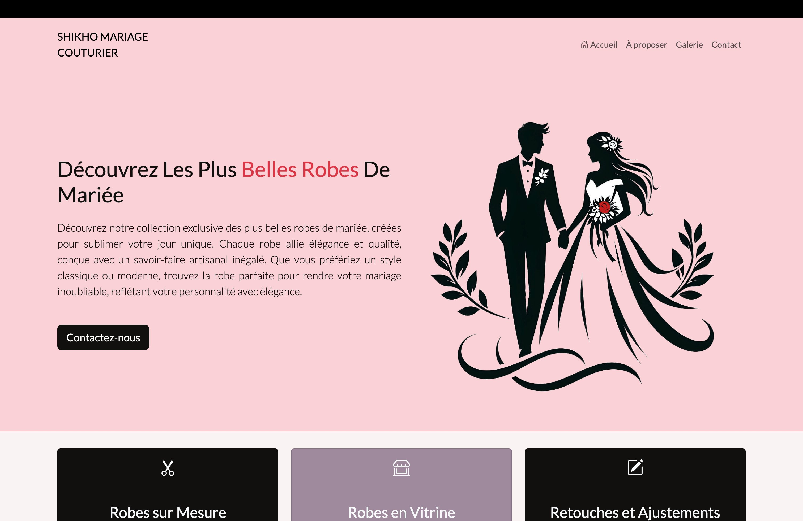
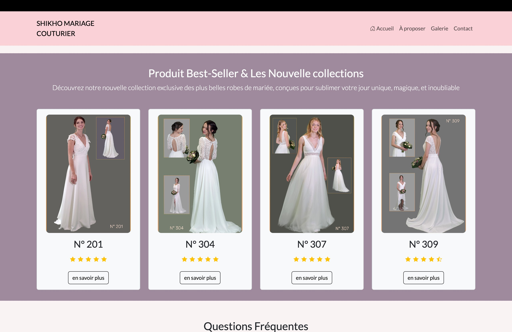
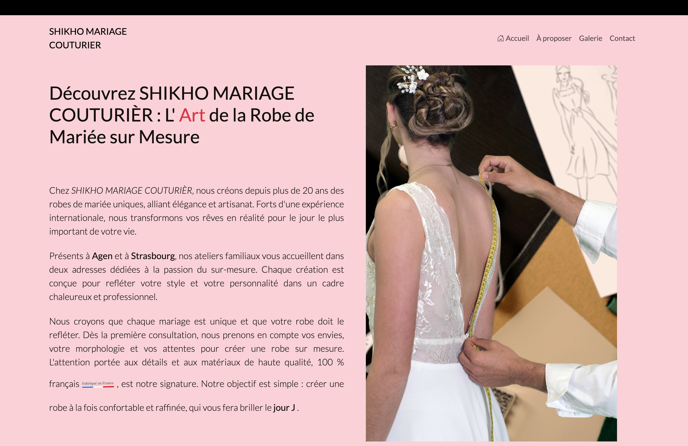
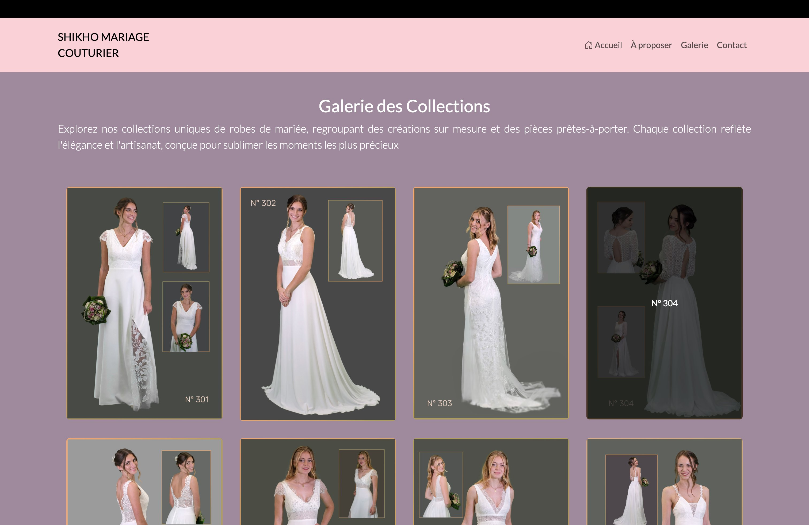
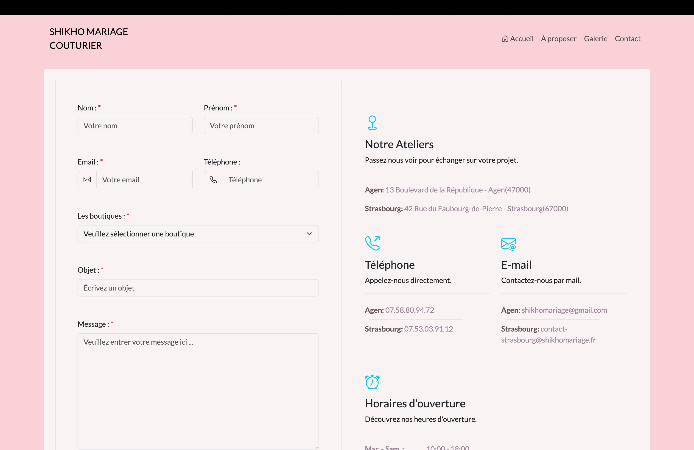

# SHIKHO Mariage Couturier

Site vitrine de l'atelier de haute couture **SHIKHO Mariage Couturier**, spécialisé dans la robe de mariée sur mesure, la retouche et les créations d'exception à Agen et à Strasbourg.

[](https://www.shikhomariage.fr/)


**Site en production :** <https://www.shikhomariage.fr>

---

## Présentation

SHIKHO Mariage Couturier est un atelier de couture dédié à la création de robes de mariée sur mesure, présent à Agen (Nouvelle-Aquitaine) et à Strasbourg (Grand Est). Ce dépôt contient le site vitrine de la maison : une application web présentant son univers, ses créations et ses coordonnées, et permettant aux visiteuses de contacter l'atelier le plus proche.

L'objectif du site est double : valoriser le savoir-faire de la maison à travers une présentation soignée, et offrir un point de contact clair pour la prise de rendez-vous.

## Aperçu



*Page d'accueil : présentation de la maison et accès aux principaux services.*



*Sélection de modèles best-sellers et nouvelles collections, avec système de notation.*



*Page « À proposer » : présentation du savoir-faire et des ateliers.*



*Galerie des collections, présentant les modèles référencés.*



*Page Contact : formulaire, coordonnées des ateliers, cartes et horaires.*

## Fonctionnalités

- Architecture monopage (SPA) avec routeur côté client et URLs canoniques.
- Configuration PWA de base (manifeste d'application et favicon).
- Interface responsive adaptée au mobile, à la tablette et à l'ordinateur.
- Page d'accueil mettant en avant les services de la maison (robes sur mesure, robes en vitrine, retouches et ajustements) ainsi qu'une sélection de modèles best-sellers avec système de notation.
- Section « Questions fréquentes » répondant aux interrogations courantes des visiteuses.
- Galerie des collections présentant les modèles référencés, avec vues multiples.
- Page de présentation (« À proposer ») dédiée au savoir-faire et aux ateliers.
- Formulaire de contact structuré (nom, prénom, e-mail, téléphone, objet, message) avec champs obligatoires et sélection de la boutique, acheminant la demande vers l'atelier concerné (Agen ou Strasbourg).
- Coordonnées complètes, cartes Google Maps et horaires d'ouverture pour chaque atelier.
- Liens vers les réseaux sociaux (Facebook, Instagram) de chaque atelier.
- Optimisation pour le référencement : balises meta, mots-clés et balises Open Graph.

## Architecture technique

Le site est une application monopage (Single Page Application) développée en JavaScript natif, sans framework. La navigation est assurée par un routeur maison (dossier `Router/`) exploitant l'API History du navigateur : les vues sont chargées dynamiquement, sans rechargement complet de la page, tout en conservant des URLs canoniques (`/`, `/aproposer`, `/galerie`, `/contact`). Les styles sont écrits en SCSS puis compilés en CSS, et la mise en page s'appuie sur Bootstrap pour un rendu responsive. Une configuration PWA de base (manifeste, favicon) est également incluse.

| Domaine               | Technologies |
| --------------------- | ------------ |
| Langages              | HTML5, CSS3, JavaScript (ES6+) |
| Préprocesseur         | SCSS |
| Mise en page          | Bootstrap |
| Navigation            | Routeur maison (API History) |
| PWA                   | Manifeste d'application (`manifest.webmanifest`) |
| Cartographie          | Google Maps (intégration par iframe) |
| Formulaire de contact | Validation des champs côté client *(service d'envoi à préciser)* |

## Conception responsive

L'interface a été conçue pour s'adapter à l'ensemble des supports — téléphone, tablette et ordinateur. La mise en page s'appuie sur le système de grille et les classes utilitaires responsives de Bootstrap, complétés par la balise `<meta name="viewport">` pour un rendu fidèle sur mobile. Les principaux contenus (galerie, cartes des ateliers, formulaire de contact) se réorganisent selon la largeur de l'écran afin de préserver la lisibilité et le confort de navigation.

## Structure du projet

```
ShikhoMariageCouturiere/
├── index.html             Point d'entrée unique de l'application
├── manifest.webmanifest   Manifeste PWA
├── Router/                Routeur côté client
├── pages/                 Vues (accueil, à proposer, galerie, contact)
├── js/                    Logique applicative et validation des formulaires
├── scss/                  Sources de styles (compilées en CSS)
└── images/                Visuels, photographies des créations et captures d'écran
```

## Installation et exécution locale

```bash
git clone https://github.com/R3zgar/ShikhoMariageCouturiere.git
cd ShikhoMariageCouturiere

# Servir le site via un serveur statique
npx serve .
# ou
python3 -m http.server 8000
```

Le site est ensuite accessible sur `http://localhost:8000`.

Le routage par URL nécessite que le serveur retourne `index.html` pour l'ensemble des routes. En local, un serveur statique tel que `serve` ou `http.server` suffit ; en production, cette réécriture est configurée côté hébergeur (fichier `_redirects` ou `200.html` sur Netlify, directive `.htaccess` sur Apache).

## Déploiement

Le site est déployé en production et accessible à l'adresse <https://www.shikhomariage.fr>.

## Ateliers

| Atelier    | Adresse                                        | Téléphone      | E-mail |
| ---------- | ---------------------------------------------- | -------------- | ------ |
| Agen       | 13 boulevard de la République, 47000 Agen      | 07 58 80 94 72 | contact-agen@shikhomariage.fr |
| Strasbourg | 42 rue du Faubourg-de-Pierre, 67000 Strasbourg | 07 53 03 91 12 | contact-strasbourg@shikhomariage.fr |

## Auteur

Développé par **Rzgar BAPIRI** — <https://github.com/R3zgar>

## Licence

Projet réalisé pour SHIKHO Mariage Couturier. Tous droits réservés.
